# Database API Application Flow Guide

## Table of Contents
1. [Application Overview](#application-overview)
2. [System Architecture Flow](#system-architecture-flow)
3. [Tenant Authentication Flow](#tenant-authentication-flow)
4. [Operation Case Flows](#operation-case-flows)
5. [Batch Processing Flow](#batch-processing-flow)
6. [Instant Data Operations Flow](#instant-data-operations-flow)
7. [Admin Approval Workflow](#admin-approval-workflow)
8. [Security & Monitoring Flow](#security--monitoring-flow)
9. [Error Handling Flow](#error-handling-flow)
10. [Complete User Journey Examples](#complete-user-journey-examples)

---

## Application Overview

This guide teaches you how the Database API application flows work from a user's perspective and system's perspective. The application supports **three distinct operation modes** with different execution patterns:

### **Operation Modes**
1. **Fresh App DB** - Building a new application database (Batch Mode)
2. **Modify/Enhance App DB** - Altering existing application database (Batch Mode)
3. **Data Operations** - Using the application for data management (Instant Mode)

### **Key Concepts**
- **Tenant-Based**: Every operation is tied to a specific tenant
- **Signature Verification**: All requests must include valid signatures
- **Admin Approval**: Batch operations require admin approval before execution
- **Auto-Generated Names**: Operations get descriptive names automatically
- **Soft Delete**: All deletions are soft deletes with recovery options

---

## System Architecture Flow

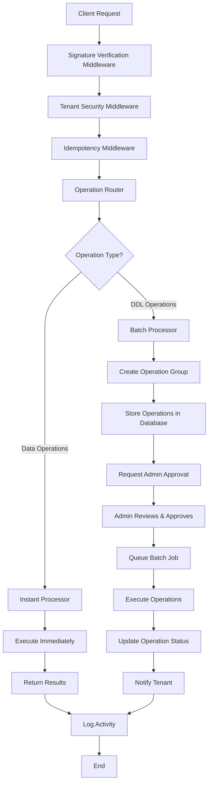

### **Flow Explanation**

1. **Request Arrives**: Client sends request with signature
2. **Middleware Chain**: Request passes through security layers
3. **Operation Routing**: System determines if operation is batch or instant
4. **Processing**: Operations are processed based on their type
5. **Response**: Results are returned and logged

---

## Tenant Authentication Flow

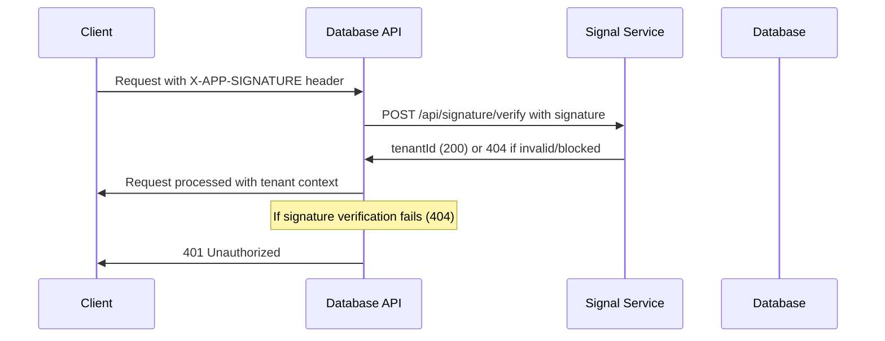

### **Step-by-Step Authentication**

1. **Client Request**: Client includes `X-APP-SIGNATURE` header
2. **Signature Verification**: API calls `signal.avinertech.com/api/signature/verify`
3. **Tenant Extraction**: System extracts `tenantId` from response (200) or handles 404
4. **Request Processing**: Add tenant context to request
5. **Security Check**: Signal service handles tenant validation and blocking

### **Authentication Code Flow**

```php
// 1. Request arrives with signature
$signature = $request->header('X-APP-SIGNATURE');

// 2. Verify signature with signal service
$response = $httpClient->post('https://signal.avinertech.com/api/signature/verify', [
    'headers' => ['X-APP-SIGNATURE' => $signature]
]);

// 3. Extract tenant information
if ($response->status() === 404) {
    throw new SignatureVerificationException('Invalid signature or tenant blocked');
}

$responseData = $response->json();
$tenantId = $responseData['tenantId'] ?? $responseData['tenant_id'];

// 4. Add tenant to request context
$request->merge(['tenant_id' => $tenantId]);
```

---

## Operation Case Flows

### **Case 1: Fresh App DB (Batch Mode)**

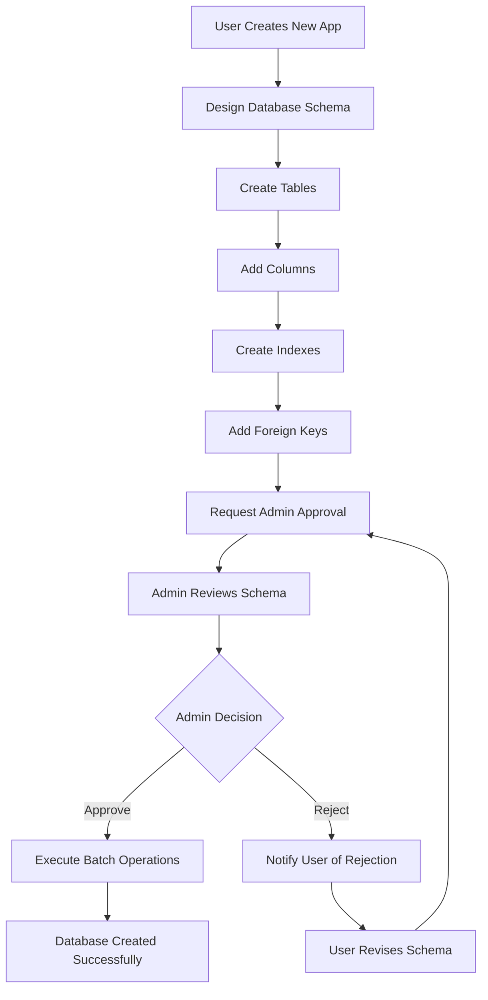

**Example Operation Names Generated:**
- `BATCH1_CREATE_USERS_TABLE`
- `BATCH1_CREATE_ORDERS_TABLE`
- `BATCH1_CREATE_ORDER_ITEMS_TABLE`
- `BATCH1_ADD_USERS_EMAIL_INDEX`

### **Case 2: Modify/Enhance App DB (Batch Mode)**

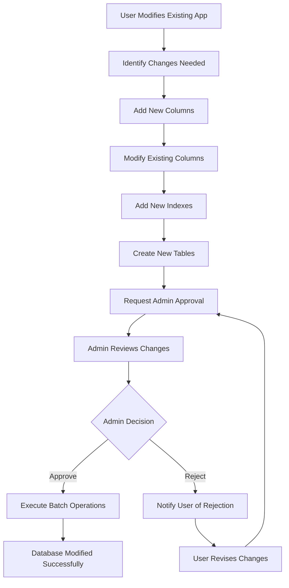

**Example Operation Names Generated:**
- `BATCH_00002_ALTER_USERS_TABLE`
- `BATCH2_00002_CREATE_USER_PROFILES_TABLE`
- `BATCH2_00002_ADD_USERS_PHONE_INDEX`

### **Case 3: Data Operations (Instant Mode)**

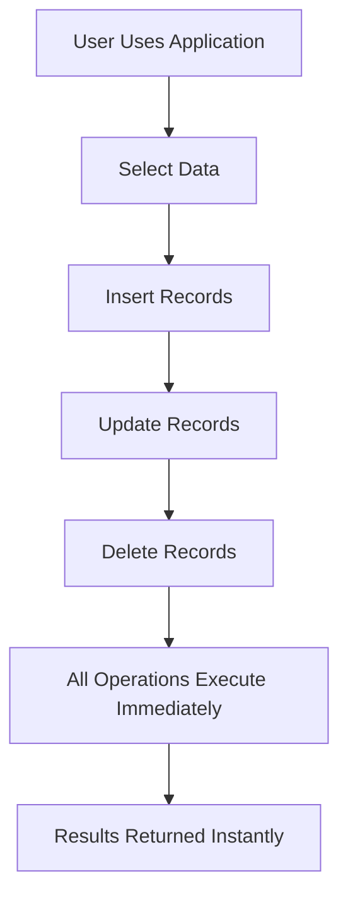

**Example Operation Names Generated:**
- `INSTANT_000001_SELECT_USERS_WITH_FILTERS`
- `INSTANT_000000000100_INSERT_USERS_RECORD` // always add 15 zeros as in if value is one then 000000000000001 and if 000000000000012
- `INSTANT_UPDATE_USERS_RECORD`
- `INSTANT_DELETE_USERS_RECORD`

### **New API Endpoints**

#### **Metadata APIs (Cached on Frontend)**
- **GET `/api/v1/database/metadata/filters`** - Returns all filter operators (equals, greater_than, like, etc.)
- **GET `/api/v1/database/metadata/aggregations`** - Returns all aggregation functions (count, sum, avg, etc.)
- **GET `/api/v1/database/metadata/columns`** - Returns all tenant table columns with full metadata

#### **Raw Query API (Strict Validation)**
- **POST `/api/v1/database/raw-query`** - Execute validated raw SELECT queries with safety checks

#### **Response Format**
All APIs now return consistent JSON responses:
```json
{
    "status": "success|error",
    "message": "Multilingual message",
    "data": { ... },
    "error": {
        "code": "ERROR_CODE",
        "details": "Error details"
    }
}
```

#### **HTTP Status Codes**
- **200** - SELECT operations successful
- **201** - CREATE/UPDATE operations successful  
- **204** - DELETE operations successful
- **400** - Bad request/validation errors
- **401** - Signature verification failed
- **403** - Operation not permitted/tenant blocked
- **404** - Resource not found
- **422** - Validation errors
- **500** - Server errors

---

## Raw Query Processing Flow

### **Raw Query Execution Process**

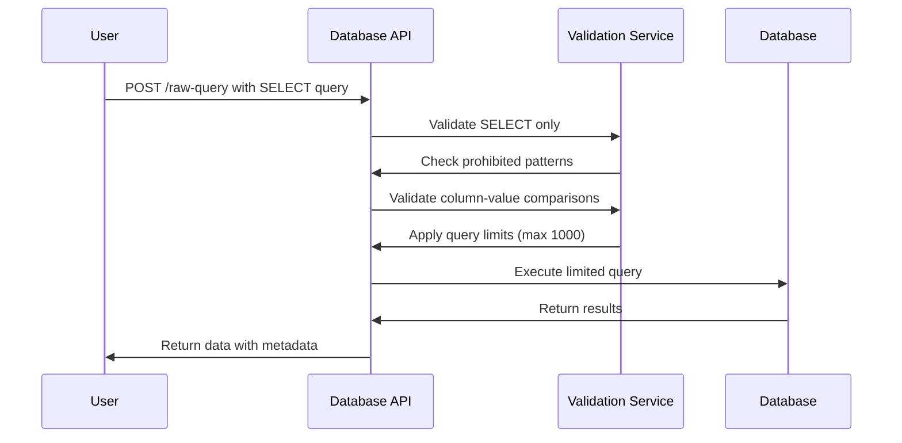

### **Raw Query Validation Rules**

1. **SELECT Only**: Query must start with SELECT
2. **No DDL/DML**: Prohibits CREATE, ALTER, DROP, INSERT, UPDATE, DELETE
3. **No Dangerous Patterns**: Blocks UNION, EXEC, stored procedures
4. **Column-Value Comparisons**: Only allows column = value, not value = value
5. **Query Limits**: Automatically applies LIMIT 1000 if not present
6. **Single Statement**: No multiple statements separated by semicolons

### **Raw Query Code Flow**

```php
// Raw query execution
public function execute(RawQueryRequest $request)
{
    $tenantId = $request->get('tenant_id');
    $query = $request->input('query');
    
    try {
        // 1. Validate SELECT only
        $this->validateSelectOnly($query);
        
        // 2. Check prohibited patterns
        $this->validateProhibitedPatterns($query);
        
        // 3. Validate column-value comparisons
        $this->validateColumnValueComparisons($query);
        
        // 4. Apply limits
        $limitedQuery = $this->applyQueryLimits($query);
        
        // 5. Execute query
        $results = DB::connection('ui_api')->select($limitedQuery);
        
        return response()->json([
            'status' => 'success',
            'message' => __('messages.query_executed_successfully'),
            'data' => [
                'results' => $results,
                'count' => count($results),
                'query_executed' => $limitedQuery,
                'limited' => $this->wasQueryLimited($query, $limitedQuery)
            ]
        ], 200);
        
    } catch (\Exception $e) {
        return response()->json([
            'status' => 'error',
            'message' => __('messages.query_execution_failed'),
            'error' => [
                'code' => 'QUERY_EXECUTION_FAILED',
                'details' => $e->getMessage()
            ]
        ], 400);
    }
}
```

---

## Metadata APIs Flow

### **Metadata Retrieval Process**

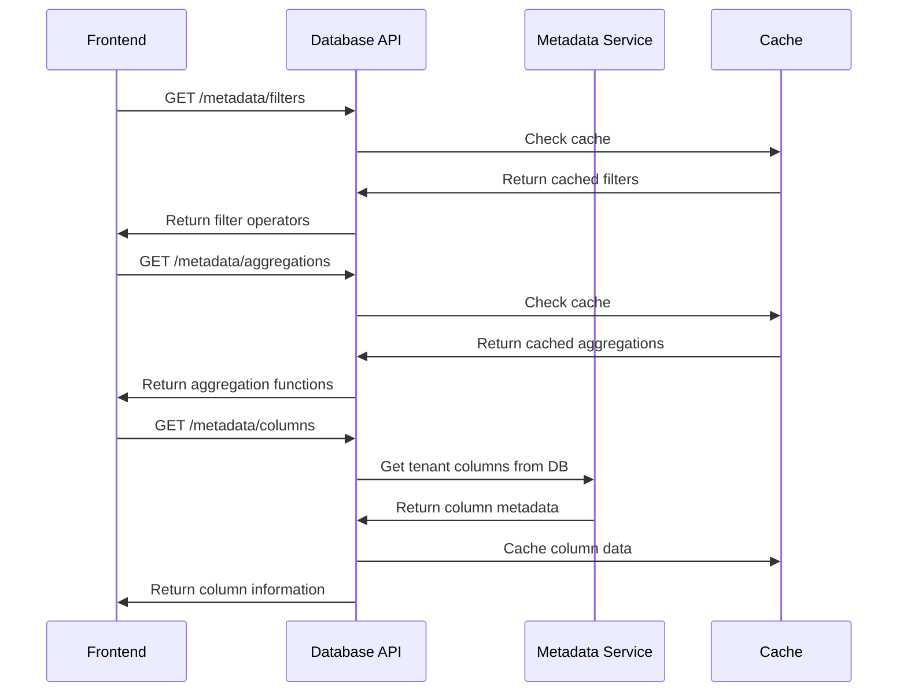

### **Metadata Response Examples**

#### **Filters API Response**
```json
{
    "status": "success",
    "message": "Filter operators retrieved successfully",
    "data": [
        {
            "name": "equals",
            "label": "Equals",
            "operator": "=",
            "description": "Exact match"
        },
        {
            "name": "greater_than",
            "label": "Greater Than",
            "operator": ">",
            "description": "Greater than value"
        }
    ]
}
```

#### **Aggregations API Response**
```json
{
    "status": "success",
    "message": "Aggregation functions retrieved successfully",
    "data": [
        {
            "name": "count",
            "label": "Count",
            "description": "Count number of records",
            "syntax": "COUNT(*)",
            "supports_group_by": true
        },
        {
            "name": "sum",
            "label": "Sum",
            "description": "Sum of numeric values",
            "syntax": "SUM(column)",
            "supports_group_by": true,
            "numeric_only": true
        }
    ]
}
```

#### **Columns API Response**
```json
{
    "status": "success",
    "message": "Table columns retrieved successfully",
    "data": [
        {
            "schema": "tenant_db",
            "table": "users",
            "column": "id",
            "position": 1,
            "data_type": "int",
            "nullable": false,
            "key": "PRI",
            "extra": "auto_increment"
        }
    ]
}
```

---

### **Detailed Batch Processing Steps**

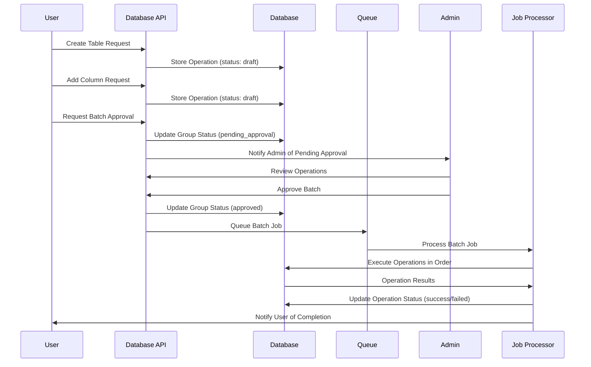

### **Batch Processing Code Flow**

```php
// 1. User creates operations
$operation1 = Operation::create([
    'tenant_id' => $tenant->id,
    'type' => 'create_table',
    'name' => 'BATCH1_CREATE_USERS_TABLE',
    'sql_preview' => 'CREATE TABLE users (...)',
    'status' => 'draft'
]);

// 2. User requests approval
$group = OperationGroup::create([
    'tenant_id' => $tenant->id,
    'status' => 'pending_approval'
]);

// 3. Admin approves
$group->update([
    'status' => 'approved',
    'approved_by' => $adminId,
    'approved_at' => now()
]);

// 4. Queue batch job
ProcessBatchOperation::dispatch($group);

// 5. Job processes operations
foreach ($group->operations as $operation) {
    DB::connection('ui_api')->statement($operation->sql_preview);
    $operation->update(['status' => 'success']);
}
```

---

## Instant Data Operations Flow

### **Instant Operation Processing**

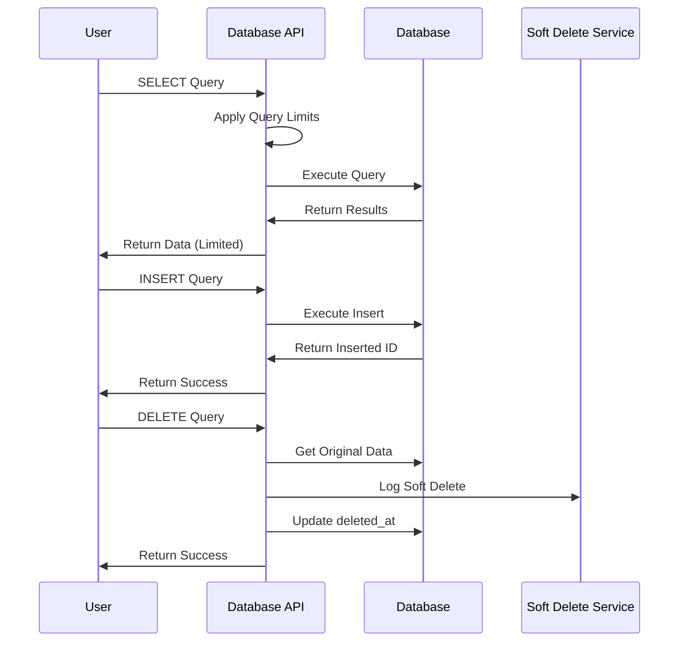

### **Query Limits Application**

```php
// For SELECT operations
public function processSelect(Operation $operation): OperationResult
{
    $sql = $operation->sql_preview;
    $limits = $this->getQueryLimits($operation);
    
    // Apply limits based on table structure
    if ($limits->hasFilters($sql)) {
        $sql .= " LIMIT {$limits->getMaxRecordsWithFilters()}"; // 100 records
    } else {
        $sql .= " LIMIT {$limits->getMaxRecordsWithoutFilters()}"; // 1000 records
    }
    
    $results = DB::connection('ui_api')->select($sql);
    
    return new OperationResult([
        'success' => true,
        'data' => $results,
        'count' => count($results),
        'limited' => count($results) >= $limits->getMaxRecordsWithoutFilters()
    ]);
}
```

### **Soft Delete Implementation**

```php
// For DELETE operations
public function processSoftDelete(Operation $operation): OperationResult
{
    $recordId = $this->extractRecordId($operation->sql_preview);
    $tableName = $operation->table_name;
    
    // Get original data before soft delete
    $originalData = DB::connection('ui_api')
        ->table($tableName)
        ->where('id', $recordId)
        ->first();
        
    // Perform soft delete
    DB::connection('ui_api')
        ->table($tableName)
        ->where('id', $recordId)
        ->update([
            'deleted_at' => now(),
            'deleted_by' => $operation->tenant_id
        ]);
        
    // Log soft delete for recovery
    $this->softDeleteService->logSoftDelete(
        $operation->tenant_id,
        $tableName,
        $recordId,
        $originalData,
        $operation->payload['signature']
    );
    
    return new OperationResult([
        'success' => true,
        'message' => 'Record soft deleted successfully',
        'record_id' => $recordId
    ]);
}
```

---

## Admin Approval Workflow

### **Admin Approval Process**

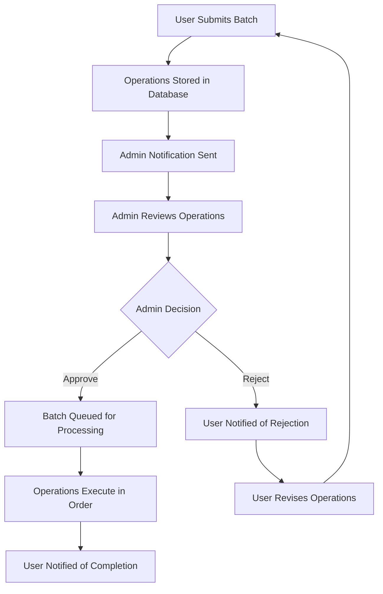

### **Admin Approval Code Flow**

```php
// 1. User requests approval
public function requestApproval(Request $request, string $groupId)
{
    $group = OperationGroup::findOrFail($groupId);
    
    // Validate user owns this group
    if ($group->tenant_id !== $request->get('tenant')->id) {
        abort(403);
    }
    
    // Update group status
    $group->update([
        'status' => 'pending_approval',
        'approval_requested_at' => now()
    ]);
    
    // Notify admins
    $this->notificationService->notifyAdminsPendingApproval($group);
    
    return response()->json([
        'success' => true,
        'message' => 'Approval requested successfully',
        'group_id' => $groupId
    ]);
}

// 2. Admin approves batch
public function approveBatch(Request $request, string $groupId)
{
    $group = OperationGroup::findOrFail($groupId);
    
    // Validate admin permissions
    $this->validateAdminPermissions($request->user(), $group);
    
    // Update group status
    $group->update([
        'status' => 'approved',
        'approved_at' => now(),
        'approved_by' => $request->user()->id
    ]);
    
    // Queue batch for processing
    ProcessBatchOperation::dispatch($group);
    
    // Notify tenant
    $this->notificationService->notifyTenantBatchApproved($group);
    
    return response()->json([
        'success' => true,
        'message' => 'Batch approved and queued for processing'
    ]);
}
```

---

## Security & Monitoring Flow

### **Security Violation Flow**

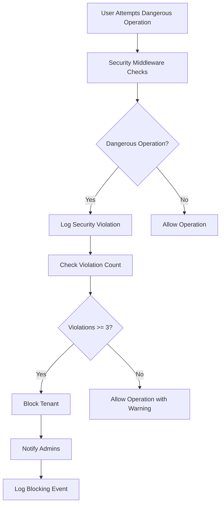

### **Security Monitoring Code**

```php
// Security middleware checks
private function validateSql(string $sql, Request $request, $tenant): void
{
    $sqlUpper = strtoupper(trim($sql));
    
    // Check deny list
    foreach (self::DENY_LIST as $denied) {
        if (strpos($sqlUpper, $denied) !== false) {
            // Log security violation
            $this->securityService->logDeniedQuery(
                $tenant,
                $request->input('type', 'unknown'),
                $sql,
                "Blocked dangerous operation: {$denied}",
                $request
            );
            
            // Check if tenant should be blocked
            $totalViolations = TenantSecurityLog::where('tenant_id', $tenant->id)->count();
            
            if ($totalViolations >= 3) {
                $this->securityService->blockTenant($tenant, 'Exceeded maximum denied queries');
            }
            
            abort(403, 'OPERATION_NOT_PERMITTED: ' . $denied . ' operations are not allowed');
        }
    }
}
```

---

## Error Handling Flow

### **Error Handling Process**

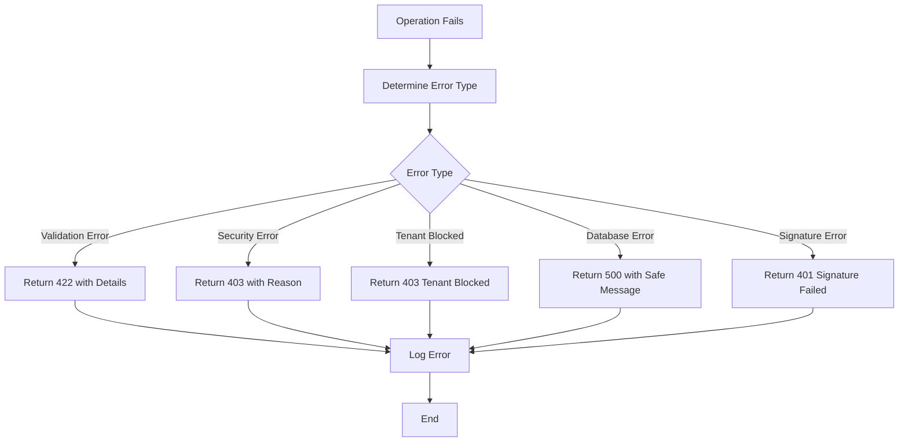

### **Error Response Format**

```php
// Standardized error response
protected function errorResponse($code, $message, $details = null, $status = 400)
{
    return response()->json([
        'success' => false,
        'error' => [
            'code' => $code,
            'message' => $message,
            'details' => $details
        ],
        'timestamp' => now()->toISOString(),
        'request_id' => request()->header('X-Request-ID', uniqid())
    ], $status);
}

// Specific error types
protected function validationErrorResponse($errors, $message = 'Validation failed')
{
    return $this->errorResponse('VALIDATION_ERROR', $message, $errors, 422);
}

protected function tenantBlockedErrorResponse($reason)
{
    return $this->errorResponse('TENANT_BLOCKED', 
        'Tenant is blocked due to security violations', 
        ['reason' => $reason], 
        403);
}
```

---

## Complete User Journey Examples

### **Example 1: Building a New E-commerce Application**

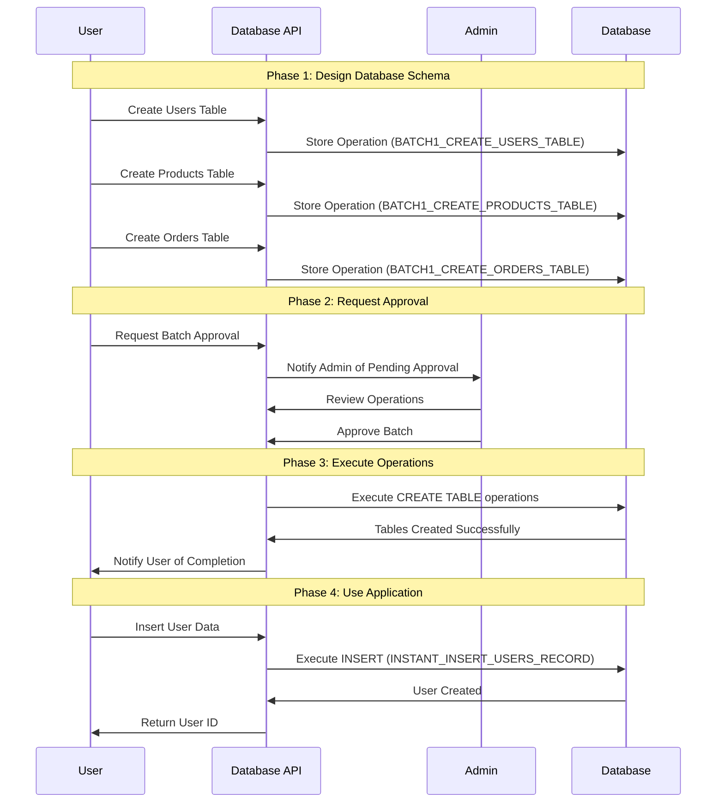

### **Example 2: Modifying Existing Application**

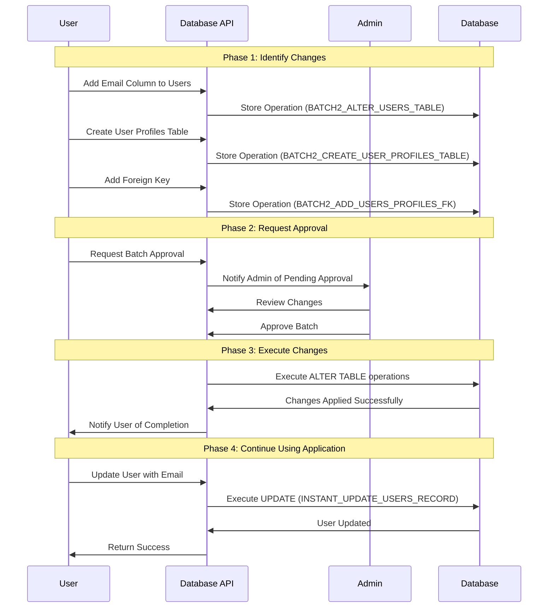

### **Example 3: Data Operations with Soft Delete**

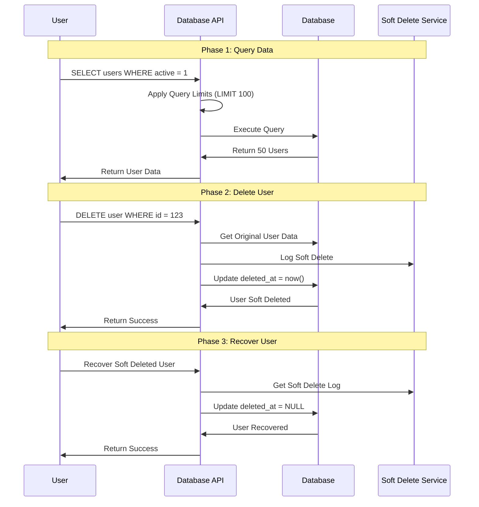

---

## Key Takeaways

### **For Developers**
1. **Always include signature verification** in requests using `/api/signature/verify`
2. **Understand the difference** between batch and instant operations
3. **Handle errors gracefully** with proper HTTP status codes (200, 201, 204, etc.)
4. **Log all operations** for audit purposes
5. **Respect query limits** for data operations
6. **Use metadata APIs** for frontend caching (filters, aggregations, columns)
7. **Implement raw query validation** with strict safety checks
8. **Use resource classes** for consistent JSON responses
9. **Support multilingual messages** using Laravel's localization

### **For Users**
1. **Batch operations** require admin approval before execution
2. **Instant operations** execute immediately
3. **All deletions are soft deletes** with recovery options
4. **Query results are limited** based on table structure
5. **Security violations** can result in tenant blocking
6. **Raw queries** are validated for safety and limited to 1000 records
7. **Metadata APIs** provide filters, aggregations, and column information
8. **Consistent response format** with status, message, and data

### **For Admins**
1. **Review batch operations** before approval
2. **Monitor security violations** and tenant blocks
3. **Use admin endpoints** for system management
4. **Track operation statistics** for system health
5. **Respond to notifications** promptly
6. **Monitor raw query usage** for security and performance
7. **Manage metadata caching** for optimal performance

This flow guide provides a comprehensive understanding of how the Database API application works from both user and system perspectives, ensuring smooth operation and proper security measures.
