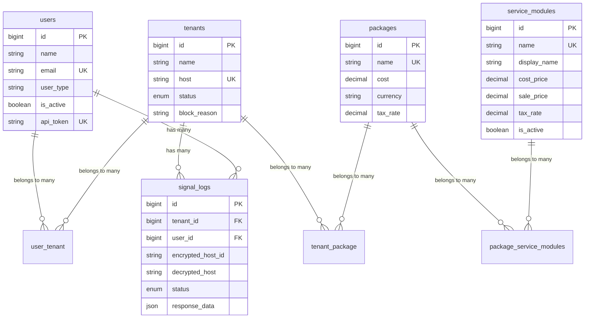

# Central Application Schema Documentation

## Overview

This Laravel 11 application implements a **Signal Handler System** with **Multi-Tenant Package Management**. The system uses a Repository-Service Pattern architecture with encrypted host ID processing, comprehensive signal logging, and modular package management.

## Architecture Pattern

- **Repository Layer**: Abstracts data access with interfaces
- **Service Layer**: Contains business logic and orchestrates repositories  
- **Controller Layer**: Handles HTTP requests and responses
- **Exception Layer**: Custom exceptions for specific error handling

---

## Core Database Tables

### 1. Authentication & User Management

#### `users`
Primary user authentication table.

| Column | Type | Constraints | Description |
|--------|------|-------------|-------------|
| `id` | BIGINT UNSIGNED | PRIMARY KEY, AUTO_INCREMENT | Unique user identifier |
| `name` | VARCHAR(255) | NOT NULL | User's full name |
| `email` | VARCHAR(255) | NOT NULL, UNIQUE | User's email address |
| `email_verified_at` | TIMESTAMP | NULLABLE | Email verification timestamp |
| `password` | VARCHAR(255) | NOT NULL, HASHED | Encrypted password |
| `user_type` | VARCHAR(255) | DEFAULT 'TENANT_ADMIN' | User role: SUPER_ADMIN, TENANT_ADMIN |
| `is_active` | BOOLEAN | DEFAULT TRUE | User account status |
| `api_token` | VARCHAR(80) | NULLABLE, UNIQUE | API authentication token |
| `remember_token` | VARCHAR(100) | NULLABLE | Laravel remember token |
| `created_at` | TIMESTAMP | NOT NULL | Record creation timestamp |
| `updated_at` | TIMESTAMP | NOT NULL | Record update timestamp |

**Indexes:**
- `users_email_unique` (email)
- `users_api_token_unique` (api_token)

#### `password_reset_tokens`
Password reset functionality.

| Column | Type | Constraints | Description |
|--------|------|-------------|-------------|
| `email` | VARCHAR(255) | PRIMARY KEY | User's email address |
| `token` | VARCHAR(255) | NOT NULL | Password reset token |
| `created_at` | TIMESTAMP | NULLABLE | Token creation timestamp |

#### `sessions`
Laravel session management.

| Column | Type | Constraints | Description |
|--------|------|-------------|-------------|
| `id` | VARCHAR(255) | PRIMARY KEY | Session identifier |
| `user_id` | BIGINT UNSIGNED | NULLABLE, INDEX | Foreign key to users.id |
| `ip_address` | VARCHAR(45) | NULLABLE | Client IP address |
| `user_agent` | TEXT | NULLABLE | Client user agent |
| `payload` | LONGTEXT | NOT NULL | Session data |
| `last_activity` | INTEGER | INDEX | Last activity timestamp |

---

### 2. Multi-Tenant System

#### `tenants` 
Core tenant management table.

| Column | Type | Constraints | Description |
|--------|------|-------------|-------------|
| `id` | BIGINT UNSIGNED | PRIMARY KEY, AUTO_INCREMENT | Unique tenant identifier |
| `name` | VARCHAR(255) | NOT NULL | Tenant company name |
| `host` | VARCHAR(255) | NOT NULL, UNIQUE | Tenant host identifier |
| `status` | ENUM | NOT NULL, DEFAULT 'active' | active, inactive, blocked |
| `block_reason` | VARCHAR(255) | NULLABLE | Reason for blocking tenant |
| `created_at` | TIMESTAMP | NOT NULL | Record creation timestamp |
| `updated_at` | TIMESTAMP | NOT NULL | Record update timestamp |

**Indexes:**
- `tenants_host_unique` (host)
- `tenants_host_status_index` (host, status)

#### `Tenant` (Legacy Migration)
Extended tenant configuration table with database connection details.

| Column | Type | Constraints | Description |
|--------|------|-------------|-------------|
| `id` | BIGINT UNSIGNED | PRIMARY KEY, AUTO_INCREMENT | Unique tenant identifier |
| `host` | VARCHAR(255) | NOT NULL | Tenant host identifier |
| `company_name` | VARCHAR(255) | NOT NULL | Company name |
| `address` | VARCHAR(255) | NOT NULL | Company address |
| `phone` | VARCHAR(255) | NOT NULL | Company phone |
| `username` | VARCHAR(255) | NOT NULL | SSH username |
| `email` | VARCHAR(255) | NOT NULL | Company email |
| `password` | VARBINARY(255) | NOT NULL, ENCRYPTED | SSH password (encrypted) |
| `port` | INTEGER | DEFAULT 22 | SSH port |
| `database_host` | VARCHAR(255) | DEFAULT 'localhost' | Database host |
| `database_port` | INTEGER | DEFAULT 3306 | Database port |
| `database_name` | VARCHAR(255) | NOT NULL | Database name |
| `database_user` | VARCHAR(255) | NOT NULL | Database username |
| `database_password` | VARBINARY(255) | NOT NULL, ENCRYPTED | Database password (encrypted) |
| `is_active` | BOOLEAN | DEFAULT TRUE | Tenant active status |
| `paid` | BOOLEAN | DEFAULT TRUE | Payment status |
| `blocked` | BOOLEAN | DEFAULT FALSE | Block status |
| `last_connection_at` | TIMESTAMP | NULLABLE | Last connection timestamp |
| `connection_log` | TEXT | NULLABLE | Connection logs |
| `application_path` | VARCHAR(255) | NOT NULL | Application path |
| `created_at` | TIMESTAMP | NOT NULL | Record creation timestamp |
| `updated_at` | TIMESTAMP | NOT NULL | Record update timestamp |
| `deleted_at` | TIMESTAMP | NULLABLE | Soft delete timestamp |

**Indexes:**
- `tenant_is_active_index` (is_active)
- `tenant_paid_index` (paid)
- `tenant_blocked_index` (blocked)
- `tenant_last_connection_at_index` (last_connection_at)

---

### 3. Package Management System

#### `packages`
Package definitions with pricing.

| Column | Type | Constraints | Description |
|--------|------|-------------|-------------|
| `id` | BIGINT UNSIGNED | PRIMARY KEY, AUTO_INCREMENT | Unique package identifier |
| `name` | VARCHAR(255) | NOT NULL, UNIQUE | Package name |
| `cost` | DECIMAL(10,2) | DEFAULT 0 | Package base cost |
| `currency` | VARCHAR(3) | DEFAULT 'USD' | Currency code |
| `tax_rate` | DECIMAL(5,4) | DEFAULT 0 | Tax rate (e.g., 0.0825 for 8.25%) |
| `created_at` | TIMESTAMP | NOT NULL | Record creation timestamp |
| `updated_at` | TIMESTAMP | NOT NULL | Record update timestamp |

**Indexes:**
- `packages_name_unique` (name)
- `packages_name_index` (name)

#### `service_modules`
Individual service modules that can be bundled into packages.

| Column | Type | Constraints | Description |
|--------|------|-------------|-------------|
| `id` | BIGINT UNSIGNED | PRIMARY KEY, AUTO_INCREMENT | Unique module identifier |
| `name` | VARCHAR(255) | NOT NULL, UNIQUE | Module system name |
| `display_name` | VARCHAR(255) | NOT NULL | Module display name |
| `description` | TEXT | NULLABLE | Module description |
| `cost_price` | DECIMAL(10,2) | DEFAULT 0 | Module cost price |
| `sale_price` | DECIMAL(10,2) | DEFAULT 0 | Module sale price |
| `tax_rate` | DECIMAL(5,4) | DEFAULT 0 | Module tax rate |
| `currency` | VARCHAR(3) | DEFAULT 'USD' | Currency code |
| `is_active` | BOOLEAN | DEFAULT TRUE | Module active status |
| `created_at` | TIMESTAMP | NOT NULL | Record creation timestamp |
| `updated_at` | TIMESTAMP | NOT NULL | Record update timestamp |

**Indexes:**
- `service_modules_name_unique` (name)
- `service_modules_name_index` (name)
- `service_modules_is_active_index` (is_active)

---

### 4. Relationship Tables

#### `user_tenant`
Many-to-many relationship between users and tenants.

| Column | Type | Constraints | Description |
|--------|------|-------------|-------------|
| `id` | BIGINT UNSIGNED | PRIMARY KEY, AUTO_INCREMENT | Unique relationship identifier |
| `user_id` | BIGINT UNSIGNED | FOREIGN KEY, CASCADE DELETE | Reference to users.id |
| `tenant_id` | BIGINT UNSIGNED | FOREIGN KEY, CASCADE DELETE | Reference to tenants.id |
| `role` | ENUM | DEFAULT 'member' | admin, member |
| `is_active` | BOOLEAN | DEFAULT TRUE | Relationship active status |
| `created_at` | TIMESTAMP | NOT NULL | Record creation timestamp |
| `updated_at` | TIMESTAMP | NOT NULL | Record update timestamp |

**Constraints:**
- `user_tenant_user_id_tenant_id_unique` (user_id, tenant_id)
- Foreign key: `user_tenant_user_id_foreign` → `users(id)`
- Foreign key: `user_tenant_tenant_id_foreign` → `tenants(id)`

#### `tenant_package`
Many-to-many relationship between tenants and packages.

| Column | Type | Constraints | Description |
|--------|------|-------------|-------------|
| `id` | BIGINT UNSIGNED | PRIMARY KEY, AUTO_INCREMENT | Unique relationship identifier |
| `tenant_id` | BIGINT UNSIGNED | FOREIGN KEY, CASCADE DELETE | Reference to tenants.id |
| `package_id` | BIGINT UNSIGNED | FOREIGN KEY, CASCADE DELETE | Reference to packages.id |
| `registered_at` | TIMESTAMP | DEFAULT CURRENT_TIMESTAMP | Package registration timestamp |
| `created_at` | TIMESTAMP | NOT NULL | Record creation timestamp |
| `updated_at` | TIMESTAMP | NOT NULL | Record update timestamp |

**Constraints:**
- `tenant_package_tenant_id_package_id_unique` (tenant_id, package_id)
- `tenant_package_tenant_id_registered_at_index` (tenant_id, registered_at)
- Foreign key: `tenant_package_tenant_id_foreign` → `tenants(id)`
- Foreign key: `tenant_package_package_id_foreign` → `packages(id)`

#### `package_service_modules`
Many-to-many relationship between packages and service modules.

| Column | Type | Constraints | Description |
|--------|------|-------------|-------------|
| `id` | BIGINT UNSIGNED | PRIMARY KEY, AUTO_INCREMENT | Unique relationship identifier |
| `package_id` | BIGINT UNSIGNED | FOREIGN KEY, CASCADE DELETE | Reference to packages.id |
| `service_module_id` | BIGINT UNSIGNED | FOREIGN KEY, CASCADE DELETE | Reference to service_modules.id |
| `created_at` | TIMESTAMP | NOT NULL | Record creation timestamp |
| `updated_at` | TIMESTAMP | NOT NULL | Record update timestamp |

**Constraints:**
- `package_service_modules_package_id_service_module_id_unique` (package_id, service_module_id)
- `package_service_modules_package_id_index` (package_id)
- `package_service_modules_service_module_id_index` (service_module_id)
- Foreign key: `package_service_modules_package_id_foreign` → `packages(id)`
- Foreign key: `package_service_modules_service_module_id_foreign` → `service_modules(id)`

---

### 5. Signal Processing & Logging

#### `signal_logs`
Comprehensive audit trail of all signal processing activities.

| Column | Type | Constraints | Description |
|--------|------|-------------|-------------|
| `id` | BIGINT UNSIGNED | PRIMARY KEY, AUTO_INCREMENT | Unique log identifier |
| `tenant_id` | BIGINT UNSIGNED | NULLABLE, FOREIGN KEY, SET NULL | Reference to tenants.id |
| `user_id` | BIGINT UNSIGNED | NULLABLE, FOREIGN KEY, SET NULL | Reference to users.id |
| `auth_user_email` | VARCHAR(255) | NULLABLE | Authenticated user email |
| `encrypted_host_id` | VARCHAR(255) | NOT NULL | Encrypted host identifier |
| `decrypted_host` | VARCHAR(255) | NULLABLE | Decrypted host value |
| `hash_payload` | TEXT | NULLABLE | Hash payload data |
| `package_name` | VARCHAR(255) | NULLABLE | Associated package name |
| `signal_timestamp` | TIMESTAMP | NULLABLE | Signal processing timestamp |
| `status` | ENUM | DEFAULT 'processing' | processing, success, failed |
| `error_message` | TEXT | NULLABLE | Error details if failed |
| `response_data` | JSON | NULLABLE | Response data payload |
| `created_at` | TIMESTAMP | NOT NULL | Record creation timestamp |
| `updated_at` | TIMESTAMP | NOT NULL | Record update timestamp |

**Indexes:**
- `signal_logs_tenant_id_created_at_index` (tenant_id, created_at)
- `signal_logs_user_id_created_at_index` (user_id, created_at)
- `signal_logs_status_created_at_index` (status, created_at)

**Constraints:**
- Foreign key: `signal_logs_tenant_id_foreign` → `tenants(id)`
- Foreign key: `signal_logs_user_id_foreign` → `users(id)`

---

### 6. Laravel System Tables

#### `jobs`
Laravel queue system for background job processing.

| Column | Type | Constraints | Description |
|--------|------|-------------|-------------|
| `id` | BIGINT UNSIGNED | PRIMARY KEY, AUTO_INCREMENT | Unique job identifier |
| `queue` | VARCHAR(255) | INDEX | Queue name |
| `payload` | LONGTEXT | NOT NULL | Job payload |
| `attempts` | TINYINT UNSIGNED | NOT NULL | Attempt count |
| `reserved_at` | INTEGER UNSIGNED | NULLABLE | Reserved timestamp |
| `available_at` | INTEGER UNSIGNED | NOT NULL | Available timestamp |
| `created_at` | INTEGER UNSIGNED | NOT NULL | Creation timestamp |

#### `job_batches`
Laravel job batch management.

| Column | Type | Constraints | Description |
|--------|------|-------------|-------------|
| `id` | VARCHAR(255) | PRIMARY KEY | Batch identifier |
| `name` | VARCHAR(255) | NOT NULL | Batch name |
| `total_jobs` | INTEGER | NOT NULL | Total jobs in batch |
| `pending_jobs` | INTEGER | NOT NULL | Pending jobs count |
| `failed_jobs` | INTEGER | NOT NULL | Failed jobs count |
| `failed_job_ids` | LONGTEXT | NOT NULL | Failed job IDs |
| `options` | MEDIUMTEXT | NULLABLE | Batch options |
| `cancelled_at` | INTEGER | NULLABLE | Cancellation timestamp |
| `created_at` | INTEGER | NOT NULL | Creation timestamp |
| `finished_at` | INTEGER | NULLABLE | Completion timestamp |

#### `failed_jobs`
Laravel failed job tracking.

| Column | Type | Constraints | Description |
|--------|------|-------------|-------------|
| `id` | BIGINT UNSIGNED | PRIMARY KEY, AUTO_INCREMENT | Unique failure identifier |
| `uuid` | VARCHAR(255) | UNIQUE | Job UUID |
| `connection` | TEXT | NOT NULL | Connection name |
| `queue` | TEXT | NOT NULL | Queue name |
| `payload` | LONGTEXT | NOT NULL | Job payload |
| `exception` | LONGTEXT | NOT NULL | Exception details |
| `failed_at` | TIMESTAMP | DEFAULT CURRENT_TIMESTAMP | Failure timestamp |

#### `cache`
Laravel cache storage.

| Column | Type | Constraints | Description |
|--------|------|-------------|-------------|
| `key` | VARCHAR(255) | PRIMARY KEY | Cache key |
| `value` | MEDIUMTEXT | NOT NULL | Cache value |
| `expiration` | INTEGER | NOT NULL | Expiration timestamp |

#### `cache_locks`
Laravel cache locking mechanism.

| Column | Type | Constraints | Description |
|--------|------|-------------|-------------|
| `key` | VARCHAR(255) | PRIMARY KEY | Lock key |
| `owner` | VARCHAR(255) | NOT NULL | Lock owner |
| `expiration` | INTEGER | NOT NULL | Lock expiration |

---

## Entity Relationships

### Core Business Logic Relationships



### Pivot Table Relationships

1. **`user_tenant`**: Links users to tenants with roles (admin/member)
2. **`tenant_package`**: Links tenants to their subscribed packages with registration timestamps
3. **`package_service_modules`**: Links packages to their included service modules

---

## Data Flow Architecture

### Signal Processing Flow

```
1. Encrypted Host ID Received
   ↓
2. Decrypt & Validate Host
   ↓
3. Lookup Tenant by Host
   ↓
4. Validate Tenant Status (active/blocked)
   ↓
5. Get Current Package & Modules
   ↓
6. Process Signal Based on Package Permissions
   ↓
7. Log All Activity to signal_logs
   ↓
8. Return Response with Package Info
```

### Package Management Flow

```
1. Service Modules Created
   ↓
2. Modules Bundled into Packages
   ↓
3. Packages Assigned to Tenants
   ↓
4. Package Permissions Checked During Signal Processing
   ↓
5. Billing/Usage Tracked via Timestamps
```

---

## Key Features & Constraints

### Security Features
- **Encrypted Passwords**: Both user and tenant database passwords are encrypted using `VARBINARY(255)`
- **API Token Authentication**: 80-character unique tokens for API access
- **Host ID Encryption**: All host identifiers are encrypted in transit
- **Soft Deletes**: Tenant records support soft deletion for data recovery

### Business Rules
- **Multi-Tenant Support**: Users can belong to multiple tenants with different roles
- **Package Hierarchy**: Packages contain multiple service modules with individual pricing
- **Status Management**: Three-tier status system (active/inactive/blocked) for tenants
- **Audit Trail**: Complete signal processing history with timestamps and error tracking
- **Token Expiration**: 1-hour token validity with timestamp validation

### Performance Optimizations
- **Strategic Indexing**: Composite indexes on frequently queried columns
- **JSON Storage**: Flexible response data storage for varying signal payloads
- **Timestamp Tracking**: Efficient time-based queries for reporting and analytics
- **Foreign Key Constraints**: Referential integrity with appropriate cascade rules

---

## Default Package Structure

The system includes four default packages:

1. **`free_package`** - Entry-level package with basic modules
2. **`basic_package`** - Standard package with additional features  
3. **`professional_package`** - Advanced package for professional users
4. **`enterprise_package`** - Full-featured package for enterprise clients

Each package contains a curated set of service modules with individual cost/sale pricing and tax rates.

---

## Migration Order

The migrations should be executed in this order to maintain referential integrity:

1. `0001_01_01_000000_create_users_table.php`
2. `0001_01_01_000001_create_cache_table.php` 
3. `0001_01_01_000002_create_jobs_table.php`
4. `2024_01_01_000001_create_tenants_table.php`
5. `2024_01_01_000002_create_packages_table.php`
6. `2024_01_01_000003_create_service_modules_table.php`
7. `2024_01_01_000003_create_tenant_package_table.php`
8. `2024_01_01_000004_create_package_service_modules_table.php`
9. `2024_01_01_000004_create_signal_logs_table.php`
10. `2024_01_01_000006_create_user_tenant_table.php`
11. `2024_03_21_create_tenant_table.php` (Legacy tenant table)

---

*This schema documentation serves as the central reference for all database operations, relationships, and data flow within the Signal Handler System.* 