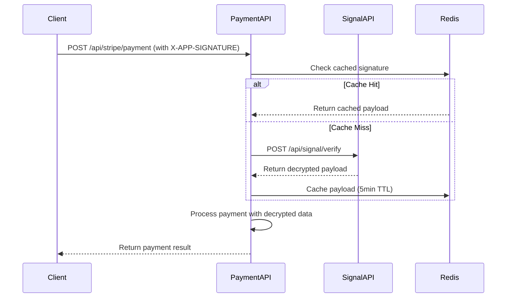
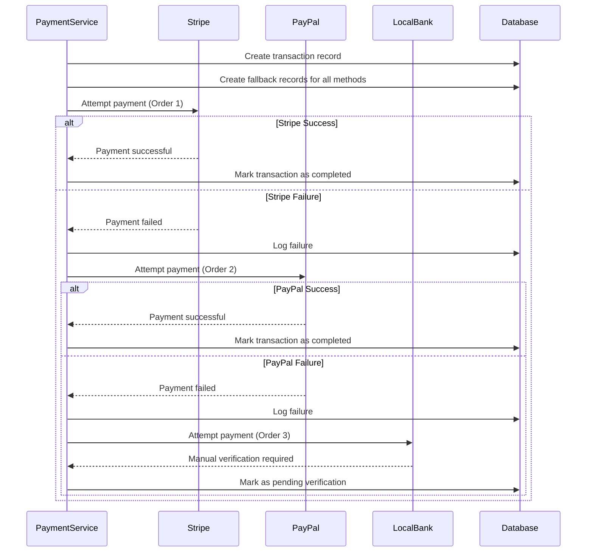

# Payment System - payment.avinertech.com

A highly scalable, fallback-capable payments system built on Laravel 11 with multi-tenant support and dynamic payment method routing.

## 🏗️ Architecture Overview

This payment system implements:

- **Repository-Service Pattern** for clean data access and business logic separation
- **Strategy Pattern** for payment provider fallbacks
- **Event-Driven Design** with Domain Events and Listeners for extensibility
- **Dynamic API Routing** with one endpoint per payment method
- **Signature Verification** integration with `signal.avinertech.com`
- **Comprehensive Fallback System** with automatic method switching

## 📋 Features

### Core Features
- ✅ Multi-tenant payment processing
- ✅ Automatic fallback between payment methods (Stripe → PayPal → Local Bank)
- ✅ Signature verification with `signal.avinertech.com`
- ✅ Comprehensive transaction logging and audit trails
- ✅ Payment dispute management
- ✅ Refund processing
- ✅ Real-time webhook handling

### Scalability Features
- ✅ Redis caching for signature verification (5-minute TTL)
- ✅ Asynchronous event processing with Laravel Queues
- ✅ Rate limiting (60 requests/minute per route)
- ✅ Stateless design for horizontal scaling
- ✅ Health check endpoints for monitoring

### Security Features
- ✅ Encrypted payload verification via Signal API
- ✅ Request signature validation
- ✅ Comprehensive input validation
- ✅ SQL injection protection via Eloquent ORM
- ✅ Rate limiting and throttling

## 🗄️ Database Schema

### Core Tables

```sql
-- Payment methods configuration
payment_methods (id, name, config, is_active, order, timestamps)

-- Transaction records
payment_transactions (id, tenant_id, method_id, transaction_id, amount, currency, status, package_cost, metadata, processed_at, timestamps)

-- Fallback attempt tracking
payment_fallbacks (id, transaction_id, method_id, attempt_order, status, error_message, tried_at, timestamps)

-- Detailed logging
payment_logs (id, transaction_id, log_message, level, context, created_at)

-- Dispute management
payment_disputes (id, transaction_id, tenant_id, reason, status, disputed_amount, evidence, resolved_at, timestamps)
```

## 🚀 Installation & Setup

### 1. Environment Configuration

Create a `.env` file with the following variables:

```env
# Application
APP_NAME="Payment System"
APP_ENV=production
APP_DEBUG=false
APP_URL=https://payment.avinertech.com

# Database
DB_CONNECTION=mysql
DB_HOST=127.0.0.1
DB_PORT=3306
DB_DATABASE=payment_system
DB_USERNAME=payment_user
DB_PASSWORD=secure_password

# Redis (for caching and queues)
REDIS_HOST=127.0.0.1
REDIS_PASSWORD=null
REDIS_PORT=6379

# Queue Configuration
QUEUE_CONNECTION=redis

# Cache Configuration
CACHE_DRIVER=redis

# Payment Method Configurations
# Stripe
STRIPE_SECRET_KEY=sk_live_your_stripe_secret_key
STRIPE_PUBLISHABLE_KEY=pk_live_your_stripe_publishable_key
STRIPE_WEBHOOK_SECRET=whsec_your_webhook_secret

# PayPal
PAYPAL_CLIENT_ID=your_paypal_client_id
PAYPAL_CLIENT_SECRET=your_paypal_client_secret
PAYPAL_WEBHOOK_ID=your_webhook_id

# Signal API Integration
SIGNAL_API_URL=https://signal.avinertech.com
SIGNAL_VERIFY_ENDPOINT=/api/signal/verify

# Monitoring & Logging
LOG_CHANNEL=stack
LOG_LEVEL=info
```

### 2. Database Setup

```bash
# Run migrations
php artisan migrate

# Seed payment methods
php artisan db:seed --class=PaymentMethodSeeder
```

### 3. Queue Workers

```bash
# Start queue workers for background processing
php artisan queue:work redis --queue=default --sleep=3 --tries=3 --max-time=3600

# For production, use Supervisor to manage queue workers
```

### 4. Web Server Configuration

#### Nginx Configuration
```nginx
server {
    listen 80;
    listen [::]:80;
    server_name payment.avinertech.com;
    root /var/www/payment.avinertech.com/public;

    add_header X-Frame-Options "SAMEORIGIN";
    add_header X-Content-Type-Options "nosniff";

    index index.php;

    charset utf-8;

    location / {
        try_files $uri $uri/ /index.php?$query_string;
    }

    location = /favicon.ico { access_log off; log_not_found off; }
    location = /robots.txt  { access_log off; log_not_found off; }

    error_page 404 /index.php;

    location ~ \.php$ {
        fastcgi_pass unix:/var/run/php/php8.2-fpm.sock;
        fastcgi_param SCRIPT_FILENAME $realpath_root$fastcgi_script_name;
        include fastcgi_params;
    }

    location ~ /\.(?!well-known).* {
        deny all;
    }
}
```

## 📡 API Documentation

### Base URL
```
https://payment.avinertech.com/api
```

### Authentication
All payment endpoints require the `X-APP-SIGNATURE` header for signature verification.

### Endpoints

#### 1. Process Payment
```http
POST /api/{method}/payment
```

**Supported Methods:** `stripe`, `paypal`, `local_bank`

**Headers:**
```http
X-APP-SIGNATURE: encrypted_signature_from_signal_api
Content-Type: application/json
```

**Request Body:**
```json
{
    "tenant_id": 123,
    "amount": 99.99,
    "currency": "USD",
    "package_cost": 89.99,
    "metadata": {
        "order_id": "ORDER_123",
        "customer_email": "customer@example.com"
    }
}
```

**Success Response (200):**
```json
{
    "success": true,
    "message": "Payment processed successfully",
    "data": {
        "transaction_id": "pi_1234567890abcdef",
        "status": "completed",
        "method_used": "stripe",
        "amount": 99.99,
        "currency": "USD"
    }
}
```

**Error Response (422):**
```json
{
    "success": false,
    "error": "Payment processing failed",
    "message": "Payment failed with all available methods"
}
```

#### 2. Verify Payment
```http
GET /api/payment/verify/{transactionId}
```

**Headers:**
```http
X-APP-SIGNATURE: encrypted_signature_from_signal_api
```

**Success Response (200):**
```json
{
    "success": true,
    "message": "Payment verification completed",
    "data": {
        "status": "completed",
        "verified": true,
        "provider_data": {
            "id": "pi_1234567890abcdef",
            "status": "succeeded"
        }
    }
}
```

#### 3. Process Refund
```http
POST /api/payment/refund/{transactionId}
```

**Headers:**
```http
X-APP-SIGNATURE: encrypted_signature_from_signal_api
Content-Type: application/json
```

**Request Body:**
```json
{
    "amount": 50.00  // Optional: partial refund amount
}
```

**Success Response (200):**
```json
{
    "success": true,
    "message": "Refund processed successfully",
    "data": {
        "refund_id": "re_1234567890abcdef",
        "amount_refunded": 50.00,
        "status": "completed"
    }
}
```

#### 4. Health Check
```http
GET /api/healthz
```

**Response (200):**
```json
{
    "status": "healthy",
    "service": "payment.avinertech.com",
    "timestamp": "2024-12-20T10:30:00Z",
    "version": "1.0.0"
}
```

## 🔄 Payment Flow

### 1. Signature Verification Flow


### 2. Fallback Processing Flow


## 🎯 Usage Examples

### Client Integration Example (JavaScript)

```javascript
// 1. Get encrypted signature from signal.avinertech.com
const getEncryptedSignature = async (payload) => {
    const response = await fetch('https://signal.avinertech.com/api/encrypt', {
        method: 'POST',
        headers: { 'Content-Type': 'application/json' },
        body: JSON.stringify({ value: JSON.stringify(payload) })
    });
    const data = await response.json();
    return data.encrypted;
};

// 2. Process payment
const processPayment = async (paymentData) => {
    const signature = await getEncryptedSignature(paymentData);
    
    const response = await fetch('https://payment.avinertech.com/api/stripe/payment', {
        method: 'POST',
        headers: {
            'Content-Type': 'application/json',
            'X-APP-SIGNATURE': signature
        },
        body: JSON.stringify(paymentData)
    });
    
    return await response.json();
};

// Usage
const result = await processPayment({
    tenant_id: 123,
    amount: 99.99,
    currency: 'USD',
    metadata: {
        order_id: 'ORDER_123'
    }
});

console.log('Payment result:', result);
```

### PHP Client Example

```php
<?php

class PaymentClient 
{
    private $signalApiUrl = 'https://signal.avinertech.com';
    private $paymentApiUrl = 'https://payment.avinertech.com/api';
    
    public function processPayment(array $paymentData): array 
    {
        // Get encrypted signature
        $signature = $this->getEncryptedSignature($paymentData);
        
        // Process payment
        $response = Http::withHeaders([
            'X-APP-SIGNATURE' => $signature,
            'Content-Type' => 'application/json'
        ])->post($this->paymentApiUrl . '/stripe/payment', $paymentData);
        
        return $response->json();
    }
    
    private function getEncryptedSignature(array $payload): string 
    {
        $response = Http::post($this->signalApiUrl . '/api/encrypt', [
            'value' => json_encode($payload)
        ]);
        
        return $response->json()['encrypted'];
    }
}

// Usage
$client = new PaymentClient();
$result = $client->processPayment([
    'tenant_id' => 123,
    'amount' => 99.99,
    'currency' => 'USD'
]);
```

## 🔧 Configuration Management

### Adding New Payment Methods

1. **Create Payment Controller:**
```php
<?php
namespace App\Http\Controllers\Payment;

use App\Contracts\PaymentInterface;

class NewMethodPaymentController extends Controller implements PaymentInterface 
{
    // Implement required methods
}
```

2. **Add Database Record:**
```php
PaymentMethod::create([
    'name' => 'new_method',
    'config' => [
        'api_key' => 'your_api_key',
        'sandbox_mode' => true
    ],
    'is_active' => true,
    'order' => 4  // Fallback order
]);
```

3. **Register in Service Provider:**
```php
$this->app->tag([
    'App\Http\Controllers\Payment\NewMethodPaymentController',
], 'payment.driver');
```

### Configuring Fallback Order

Update the `order` field in the `payment_methods` table:

```sql
UPDATE payment_methods SET `order` = 1 WHERE name = 'stripe';
UPDATE payment_methods SET `order` = 2 WHERE name = 'paypal';
UPDATE payment_methods SET `order` = 3 WHERE name = 'local_bank';
```

## 📊 Monitoring & Observability

### Health Checks

The system provides multiple health check endpoints:

- `/api/up` - Basic Laravel health check
- `/api/healthz` - Payment system specific health check

### Logging

All payment activities are logged with different levels:

- **INFO**: Successful operations, payment initiations
- **WARNING**: Fallback attempts, retry operations
- **ERROR**: Payment failures, system errors
- **CRITICAL**: System-wide failures, security issues

### Metrics Collection

Key metrics to monitor:

- Payment success rates by method
- Average processing time
- Fallback usage frequency
- Error rates by tenant
- Queue processing times

### Example Monitoring Setup (Prometheus)

```yaml
# docker-compose.yml
version: '3.8'
services:
  app:
    # ... your app configuration
    
  redis:
    image: redis:alpine
    
  prometheus:
    image: prom/prometheus
    ports:
      - "9090:9090"
    volumes:
      - ./prometheus.yml:/etc/prometheus/prometheus.yml
      
  grafana:
    image: grafana/grafana
    ports:
      - "3000:3000"
    environment:
      - GF_SECURITY_ADMIN_PASSWORD=admin
```

## 🚀 Deployment

### Docker Deployment

```dockerfile
# Dockerfile
FROM php:8.2-fpm

# Install dependencies
RUN apt-get update && apt-get install -y \
    git \
    curl \
    libpng-dev \
    libonig-dev \
    libxml2-dev \
    zip \
    unzip

# Install PHP extensions
RUN docker-php-ext-install pdo_mysql mbstring exif pcntl bcmath gd

# Install Composer
COPY --from=composer:latest /usr/bin/composer /usr/bin/composer

# Set working directory
WORKDIR /var/www

# Copy application
COPY . .

# Install dependencies
RUN composer install --no-dev --optimize-autoloader

# Set permissions
RUN chown -R www-data:www-data /var/www
RUN chmod -R 755 /var/www/storage

EXPOSE 9000
CMD ["php-fpm"]
```

### Kubernetes Deployment

```yaml
# k8s-deployment.yml
apiVersion: apps/v1
kind: Deployment
metadata:
  name: payment-api
spec:
  replicas: 3
  selector:
    matchLabels:
      app: payment-api
  template:
    metadata:
      labels:
        app: payment-api
    spec:
      containers:
      - name: payment-api
        image: payment-api:latest
        ports:
        - containerPort: 9000
        env:
        - name: DB_HOST
          value: "mysql-service"
        - name: REDIS_HOST
          value: "redis-service"
        resources:
          requests:
            memory: "256Mi"
            cpu: "250m"
          limits:
            memory: "512Mi"
            cpu: "500m"
---
apiVersion: v1
kind: Service
metadata:
  name: payment-api-service
spec:
  selector:
    app: payment-api
  ports:
  - port: 80
    targetPort: 9000
  type: LoadBalancer
```

## 🧪 Testing

### Running Tests

```bash
# Run all tests
php artisan test

# Run specific test suites
php artisan test --testsuite=Feature
php artisan test --testsuite=Unit

# Run with coverage
php artisan test --coverage
```

### Test Categories

1. **Unit Tests**: Individual component testing
2. **Integration Tests**: Service interaction testing
3. **Feature Tests**: End-to-end API testing
4. **Performance Tests**: Load and stress testing

## 🔒 Security Considerations

### Best Practices Implemented

1. **Input Validation**: All inputs validated using Laravel Form Requests
2. **SQL Injection Prevention**: Using Eloquent ORM exclusively
3. **Rate Limiting**: 60 requests per minute per endpoint
4. **Signature Verification**: All requests must be signed
5. **Encrypted Communication**: HTTPS only
6. **Audit Logging**: All transactions logged with full context

### Security Checklist

- [ ] SSL/TLS certificates configured
- [ ] Database credentials secured
- [ ] API keys stored in environment variables
- [ ] Rate limiting configured
- [ ] Input validation implemented
- [ ] Audit logging enabled
- [ ] Error messages sanitized
- [ ] CORS policies configured

## 🤝 Contributing

### Development Setup

```bash
# Clone repository
git clone https://github.com/avinertech/payment.avinertech.com.git
cd payment.avinertech.com

# Install dependencies
composer install
npm install

# Setup environment
cp .env.example .env
php artisan key:generate

# Run migrations
php artisan migrate

# Start development server
php artisan serve
```

### Code Standards

- Follow PSR-12 coding standards
- Use type hints for all parameters and return types
- Write comprehensive tests for new features
- Document all public methods
- Use meaningful commit messages

## 📞 Support

For technical support or questions:

- **Email**: support@avinertech.com
- **Documentation**: https://docs.avinertech.com/payment-system
- **Status Page**: https://status.avinertech.com

## 📄 License

This project is proprietary software owned by Aviner Technologies. All rights reserved.

---

**Version**: 1.0.0  
**Last Updated**: December 2024  
**Maintained By**: Aviner Technologies Payment Team 